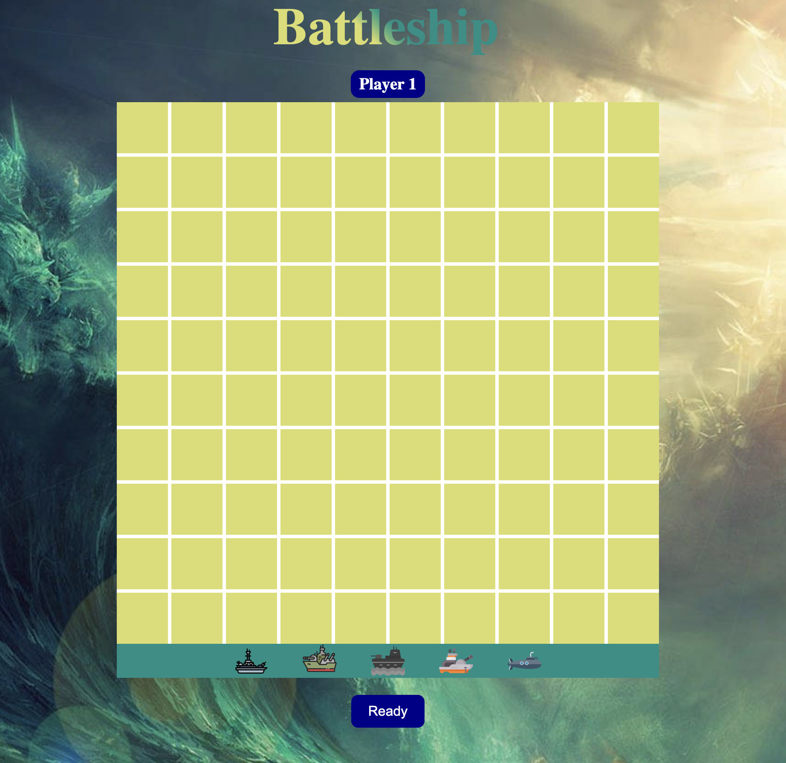

<h2 align="center">Battleship</h2>

  <p align="center">
	Battleship is the final project of The Odin Project Javascript course.
    <br />
    <a href="https://github.com/PhilipTimofeyev/battleship"><strong>Explore the docs »</strong></a>
    <br />
    <br />
    <a href="https://battleship-philip-timofeyev.netlify.app/">View Demo</a>
    ·
    <a href="https://github.com/PhilipTimofeyev/battleship/issues/new?labels=bug&template=bug-report---.md">Report Bug</a>
    ·
    <a href="https://github.com/PhilipTimofeyev/battleship/issues/new?labels=enhancement&template=feature-request---.md">Request Feature</a>
  </p>

</div>


<!-- TABLE OF CONTENTS -->

<details>
  <summary>Table of Contents</summary>
  <ol>
    <li>
      <a href="#about-the-project">About The Project</a>
      <ul>
        <li><a href="#built-with">Built With</a></li>
      </ul>
    </li>
    <li>
      <a href="#getting-started">Getting Started</a>
      <ul>
        <li><a href="#prerequisites">Prerequisites</a></li>
        <li><a href="#installation">Installation</a></li>
      </ul>
    </li>
    <li><a href="#usage">Usage</a></li>
    <li><a href="#roadmap">Roadmap</a></li>
    <li><a href="#contributing">Contributing</a></li>
    <li><a href="#license">License</a></li>
    <li><a href="#contact">Contact</a></li>
    <li><a href="#acknowledgments">Acknowledgments</a></li>
  </ol>
</details>


<!-- ABOUT THE PROJECT -->

## About The Project


<p align="right">(<a href="#readme-top">back to top</a>)</p>

This project explores:

- Testing using the Jest JS testing framework
- Use of ES6 modules to encapsulate code and improve dependency management
- Responsive design
- More complex JS functionality such as drag and drop
- Sophisticated computer algorithm

### Built With

[](https://skillicons.dev)

- Javascript
- HTML/CSS
- Jest
- Webpack

<p align="right">(<a href="#readme-top">back to top</a>)</p>

<!-- GETTING STARTED -->

## Getting Started


To get a local copy up and running follow these simple example steps.

### Prerequisites

This is an example of how to list things you need to use the software and how to install them.
* npm
  ```sh
  npm install npm@latest -g
  ```

### Installation

1. Clone the repo
   ```sh
   git clone git@github.com:PhilipTimofeyev/battleship.git
   ```
2. `cd` into the folder and Install NPM packages

   ```sh
   npm install
   ```
3. Run `npx webpack`
4. Change git remote url to avoid accidental pushes to base project
   ```sh
   git remote set-url origin github_username/repo_name
   git remote -v # confirm the changes
   ```

<p align="right">(<a href="#readme-top">back to top</a>)</p>

## Usage

Once the game is loaded, the user can make a selection depending on two options:

- *Player vs Player*
- *Player vs Computer*

<h3> Player vs Player </h3>

If *Player vs Player* is selected, the user is presented with a 10x10 grid, along with 5 ships to place on the grid:




To add ships to the grid, the user drags and drops ships onto the grid. The grid actively displays how many spaces a ship takes up, and where it can be placed, by marking the grid squares red.


Once a ship is dropped onto the grid, the user can select any of the red squares to place the ship in a specific direction/orientation. The ship placement can easily be modified after placement by dragging and dropping onto a new desired location.

Once all ships have been placed, the first player selects the *Ready* button and now Player 2 places their ships onto the board.

After all ships by player 2 have been placed, the game starts with player 1 selecting an empty grid square. If the square contains a ship, the ship's icon will be revealed, if there is no ship in that square, a watersplash icon will be displayed.

If all squares of a ship type have been found, a destroyed ship icon will be displayed in the grid squares.


Whichever player destroys all of the other player's ships first, is declared the winner.

<h3> Player vs Computer </h3>

If the user selected *Player vs Computer*, in a similar fashion to *Player vs Player*, the user places all of their ships onto the grid.

The user is presented with two grids where the left grid is the player's, and the right grid is the computer's:


As the player selects squares on the right grid, the computer attacks the player's grid.

The algorithm for the computer to attack has several layers of thought.

- When there are no hit ships on the board, the computer will select a random unused square on the board to attack. The random hit algorithm uses the `validSquares` function by passing in every type of ship that has not been sunk, and every valid square (a square that is not a miss or a hit), and determining which squares could possibly contain a ship on them. 

  For example, if the Patrol ship (which takes 2 squares) has been destroyed, then any two squares that are between the boundary && miss/ship, or two misses/ships, will not be used and are removed from the options. If A1 and A4 are a miss, and A2 -A3 are empty squares, the random algorithm will never hit A2 or A3 if the patrol has been sunk, since it is impossible for there to be a ship there.

  This algorithm applies for all of the different sized ships in a similar way. 

- Once a ship is hit, the computer determines which squares are hit and which ships are left to attack. The computer determines which ship(s) are hit, then iterates over each ship, and then iterates once again over every hit square, passing in the `hitSquares`, test square (`coord`), and `ship` into the `bestSquares` function.

  The `bestSquares` function uses the ship type, hit squares, and test square to find the best squares in every cardinal direction.  By passing in the `ship`, it tests the lines for that ship size. Then the line for each direction is passed into the `checkLine` function, along with the `hitSquares` , here the line is is checked if it is valid, meaning no squares in the line are misses or sunk ships. If the line is valid, all of the squares that are empty and not hit, are pushed ot the `potentialSquares` array and returned for each direction.

- Once all of the potential square arrays are collected from every direction, the `optionArrays` are iterated over and actively update the `bestOption` array and `greatestDiff`. The `optionArrays` with the smallest length (least amount of potential squares) are considered the best options. On top of that, the `greatestDiff` variable searches for the greatest difference between the ship size and the amount of potential squares. The greater the difference, the higher the confidence that a potential square is a ship. 

  For example, if a ship with a length of 5 returns an array of 1 potential square, and a ship with a length of 3 returns an array of 2 potential squares, then this gives a difference of 4 for the larger ship, and 1 for the smaller ship. There is a greater chance the single square for the larger ship is correct as opposed to the two potential squares for the smaller ship. On top of this, the algorithm prefers searching for larger ships over smaller ones since those would be easier to find first. 

- Once all of the options have been iterated over for each of the hit squares and the ship(s), we end up with what would be considered the best squares to hit.

- The `sendAttack` function chooses the first element of the `attackOptions` array which is the best option.

<p align="right">(<a href="#readme-top">back to top</a>)</p>

<!-- CONTRIBUTING -->
## Contributing

Contributions are what make the open source community such an amazing place to learn, inspire, and create. Any contributions you make are **greatly appreciated**.

If you have a suggestion that would make this better, please fork the repo and create a pull request. You can also simply open an issue with the tag "enhancement".
Don't forget to give the project a star! Thanks again!

1. Fork the Project
2. Create your Feature Branch (`git checkout -b feature/AmazingFeature`)
3. Commit your Changes (`git commit -m 'Add some AmazingFeature'`)
4. Push to the Branch (`git push origin feature/AmazingFeature`)
5. Open a Pull Request

<!-- LICENSE -->

## License

Distributed under the MIT License. See `LICENSE.txt` for more information.

<p align="right">(<a href="#readme-top">back to top</a>)</p><!-- CONTACT -->

## Contact

Philip Timofeyev - philiptimofeyev@gmaiil.com

Project Link: [https://github.com/PhilipTimofeyev/battleship](https://github.com/PhilipTimofeyev/battleship)

<p align="right">(<a href="#readme-top">back to top</a>)</p>


<!-- ACKNOWLEDGMENTS -->

## Acknowledgments

* *Heart of Suvorov* music written by me,  Philip Timofeyev.
* Background robert_mitchell: https://wallpapers.com/wallpapers/epic-wave-in-ocean-walkrdxz87xkd3n4.html

<p align="right">(<a href="#readme-top">back to top</a>)</p>


